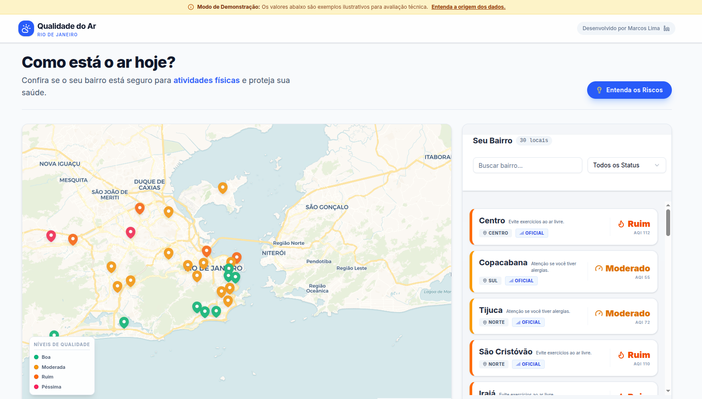

# ☁️ CivitasRio - Painel de Qualidade do Ar

Solução para o Desafio Front-end Sênior da Prefeitura do Rio de Janeiro.
Um dashboard interativo que monitora a qualidade do ar em tempo real, focado em performance, acessibilidade e arquitetura moderna.


*(Sugestão: Substitua este link por um print real da sua tela)*

## 🚀 Tecnologias e Decisões Arquiteturais

Este projeto foi construído sobre a stack mais moderna do ecossistema React para garantir SSR (Server-Side Rendering) e performance de ponta.

- **Core:** [Next.js 15](https://nextjs.org/) (App Router) + React 19 (RC).
- **Linguagem:** TypeScript (Tipagem estrita para segurança de dados).
- **Estilização:** Tailwind CSS + [shadcn/ui](https://ui.shadcn.com/) (Componentes acessíveis e consistentes).
- **Mapas:** Leaflet + React Leaflet (Renderizado via Lazy Loading para não bloquear a thread principal).
- **Gráficos:** Recharts (Leve e baseada em SVG).
- **Gerenciamento de Estado:** **URL Search Params**.
  - *Decisão:* Em vez de usar `Redux` ou `Context` para filtros, o estado é mantido na URL (`?q=copa&status=ruim`). Isso permite que os links sejam compartilháveis e o estado persista após um refresh (UX Sênior).

## ✨ Diferenciais Implementados

1.  **React Compiler (Experimental):** Ativado para otimização automática de re-renderizações (adeus `useMemo`).
2.  **Server Components:** A busca de dados e filtragem acontece no servidor, enviando menos JavaScript para o cliente.
3.  **Lazy Loading:** O mapa pesado só é carregado no cliente, com um Skeleton Loading enquanto aguarda, melhorando o LCP (Largest Contentful Paint).
4.  **Mock Inteligente:** Simulação de latência de rede (`delay`) para demonstrar tratamento de estados de carregamento (Skeletons).

## 🛠️ Como Rodar o Projeto

### Pré-requisitos
- Node.js 18+
- npm ou yarn

### Instalação

```bash
# 1. Clone o repositório
git clone [https://github.com/SEU-USUARIO/civitas-frontend.git](https://github.com/SEU-USUARIO/civitas-frontend.git)

# 2. Instale as dependências
npm install

# 3. Rode o servidor de desenvolvimento (com Turbopack)
npm run dev
Acesse http://localhost:3000.

📂 Estrutura de Pastas
Plaintext

src/
├── app/
│   ├── (dashboard)/      # Rotas principais (Home)
│   ├── bairro/[id]/      # Rota dinâmica de detalhes (SSR)
├── components/
│   ├── map/              # Lógica complexa de Mapas (Client Side Wrappers)
│   ├── dashboard/        # Componentes de negócio (Gráficos, Filtros)
│   └── ui/               # Componentes base (Shadcn)
├── services/             # Camada de API (Mockada)
└── types/                # Definições TypeScript (Contratos)
✅ Checklist de Requisitos
[x] Mapa Interativo com Leaflet

[x] Filtros por Bairro e Status

[x] Lista lateral com indicadores de AQI

[x] Página de Detalhes com Gráfico Histórico

[x] Responsividade (Mobile First)

[x] Loading States (Skeletons)

Desenvolvido por Marcos Lima.